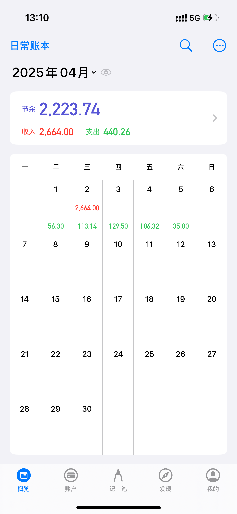
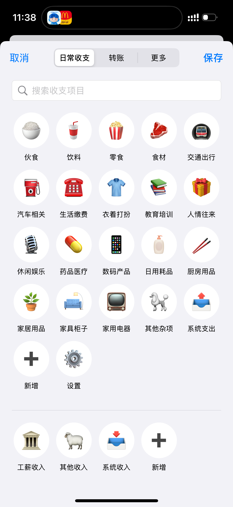
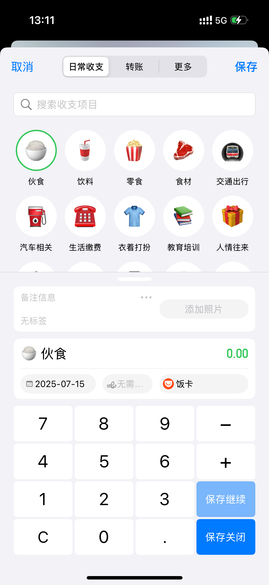
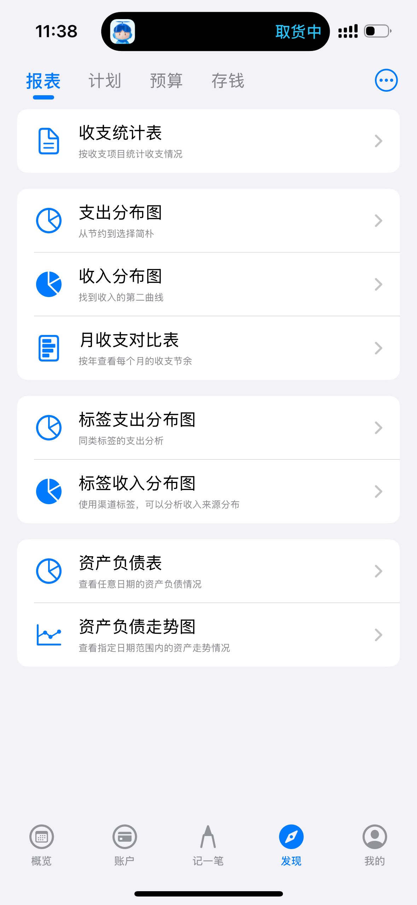
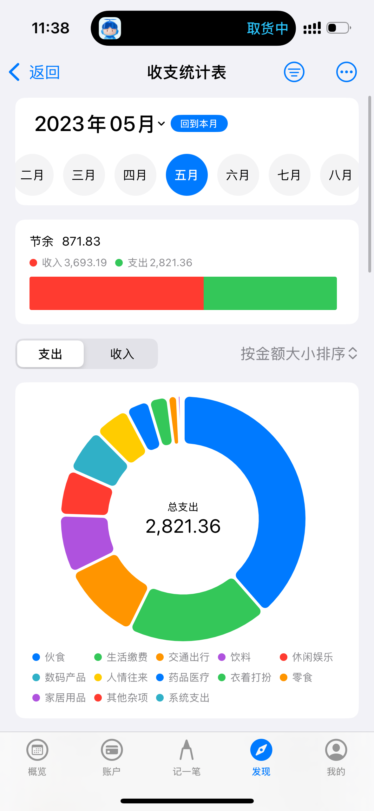
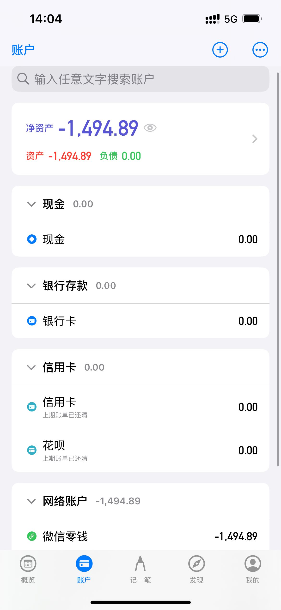
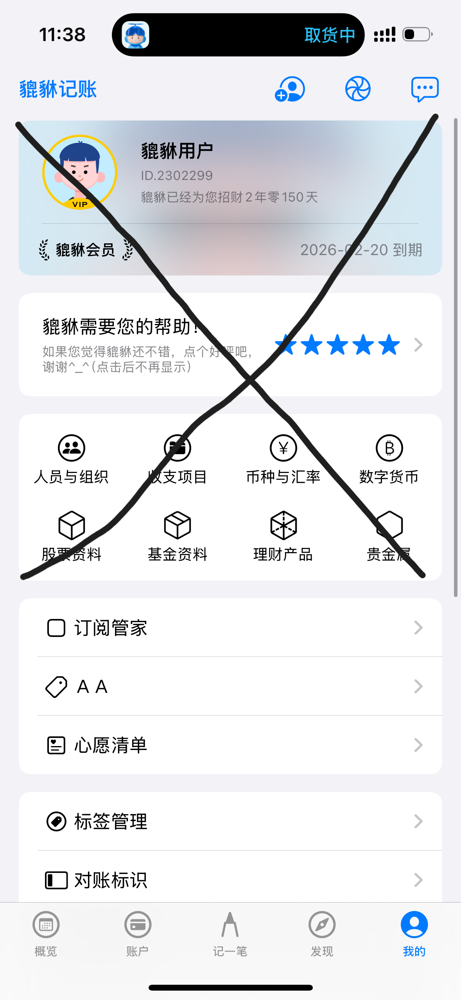

# 记账APP

目前已有的源码效果如下

  
  
  
  

## 所使用的技术栈

| 领域         | 技术方案                                   |
| ------------ | ------------------------------------------ |
| **前端框架** | ArkTS + ArkUI                              |
| **架构模式** | HarmonyOS Stage模型                        |
| **数据存储** | 关系型数据库（@ohos.data.relationalStore） |
| **动画引擎** | 属性动画 + 转场动画                        |
| **构建工具** | DevEco Studio 5.0+                         |

## 项目重构方向

| 模块名                                                | 功能说明                                                 |
| ----------------------------------------------------- | -------------------------------------------------------- |
| `entry/src/main/ets/pages/home/home.ets`              | 首页：日历显示收支状况，点击某一日期可以查看当天收支明细 |
| `entry/src/main/ets/pages/record/record.ets`          | 记账页面：收入/支出、账户、分类、标签、备注；转账        |
| `entry/src/main/ets/pages/discovery/analysis`         | 报表分析：收支统计表、支出分布图、收入分布图等           |
| `entry/src/main/ets/pages/discovery/budget（先不做）` | 预算页面：设置分类预算、显示进度条、消费警告             |
| `entry/src/main/ets/pages/account`                    | 账户管理：添加、编辑账户，显示余额，查看账户收支明细     |
| `entry/src/main/ets/pages/settings`                   | 设置中心：关于                                           |

### 首页

  
  

### 记账界面

  
  

### 发现页

  
  

### 账户

  

### 设置中心

  

