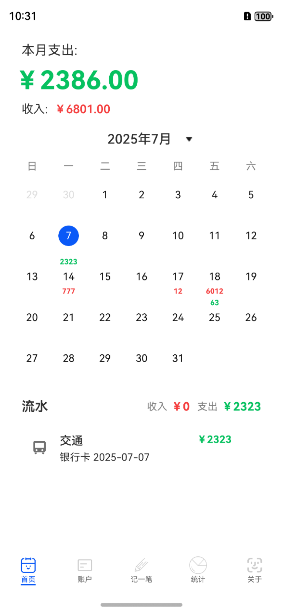
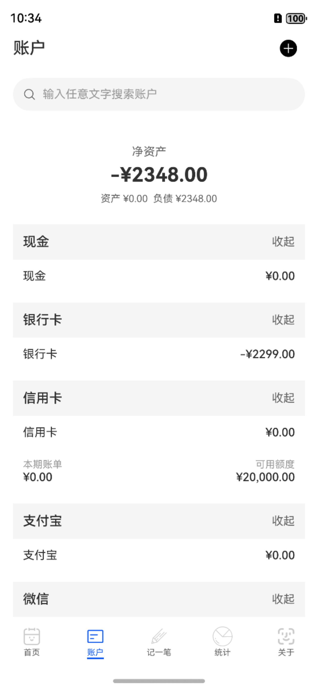
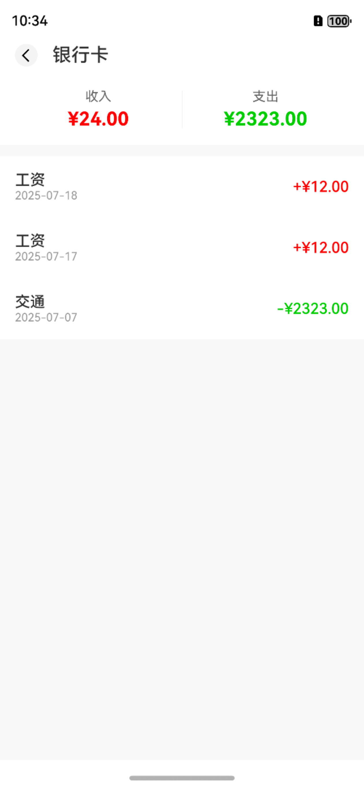
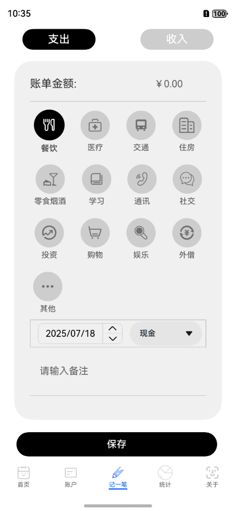

# 记账APP

### 运行效果图

  
  
  

  
  

## 所使用的技术栈

| 领域         | 技术方案                                   |
| ------------ | ------------------------------------------ |
| **前端框架** | ArkTS + ArkUI                              |
| **架构模式** | HarmonyOS Stage模型                        |
| **数据存储** | 关系型数据库（@ohos.data.relationalStore） |
| **动画引擎** | 属性动画 + 转场动画                        |
| **构建工具** | DevEco Studio 5.0+                         |
